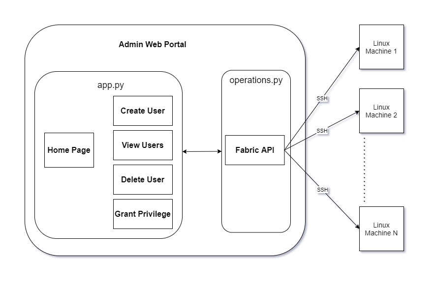
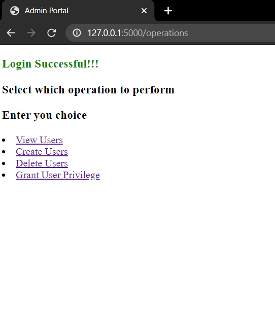

# WebAdmin


## Architecture Diagram



## Detailed Workflow
1. `operations.py`
    - Each method is a static method which is stateless
    - Each method takes at least three arguments that has machine ip, username and password to create a remote connection to machine.
    - Made use of fabric python library to execute shell commands on remote machine via SSH connection.
    - A connection is created for each execution of a method and closed after completion of the operation.
    - All the methods handles any exception that is thrown due to various reasons and returns respective message.

2. `app.py`
    - Made use of Flask micro-framework to host dynamic templates that provides content and forms to the user.
    - After successful authentication, session variables are created which stored machine credentials on browser.
    - There are following routes of web portal:
        1. `/home`

            Uses GET method to provide Home page that asks for machine IP, credentials for root user.
            If root credentials are not provided, login stays successful but privileged actions like creating, deleting and granting privilege to other users fails.
        
        2. `/connect`

            Uses POST method to validate and create session variable for the user after successful authentication otherwise shows 'Login unsuccessful' message.

        3. `/operations`

            Uses GET method to host operations.html page that provides links to different actions that are available for the user.
            - View Users
            - Create User
            - Delete User
            - Grant User Privilege
        
        4. `/view`

            Uses GET method to list all the users that resides in the machine
            
        5. `/create`

            Uses GET method to host Create User template that has form asking for details like username, password and home directory name for user.
            And POST method to execute create user operation from `operations.py`.
            
        6. `/delete`

            Uses GET method to host Delete User template that has form asking for details like username of the user to be deleted.
            And POST method to execute delete user operation from `operations.py`.

        7. `/assign-privilege`

            Uses GET method to host Grant user privilege template that has form asking for details like username for user.
            And POST method to execute grant user privilege operation from `operations.py`.
    
3. `templates`
    - Since Flask has dependency of Jinja2 which is used for template rendering, it provides dynamic HTML content.
    - Made use of Jinja to run 
    ```python
    
        <li>{{user}}</li>
    

    <h3 style="color:{{color}}">{{message}}</h3>
    ```


---
## Decisions
1. ### Why Virtual Environment?
    Since python has an ever changing and growing community, dependencies differ with each version. Therefore, python provides virtual environment for each project, thus avoiding global dependency of each version of some library.
    To activate virtual env.
    ```
    $ python -m venv env
    $ . env/Scripts/activate
    $ (env) pip install -r requirements.txt
    ```

2. ### Why Flask?
    Flask is a light-weight framework popularly categorized as a micro framework. Flask is a good choice as it offers flexibility. Flask applications are mostly single-page applications (SPAs). It’s a good choice for small and medium-sized web applications.
    To run the application
    ```
    $ (env) python app.py
    ```

3. ### Why Fabric?
    Fabric is a Python library and command-line tool for streamlining the use of SSH for application deployment or systems administration tasks. Fabric is very simple and powerful and can help to automate repetitive command-line tasks. This approach can save time by automating your entire workflow.
    ```python
    from fabric import Connection
    
    with Connection(host = '10.10.10.1',user = 'user', connect_kwargs={"password": 'passwd'}) as conn:
        conn.run('uname -s')
    ```
---

## Points of extension

In order to create a secure connection between the client and server we can setup a HTTPS connection which requires SSL certificates to be configured.

---
## References:
1. https://flask.palletsprojects.com/en/1.1.x/quickstart/
2. https://pythonbasics.org/flask-sessions/
3. http://docs.pyinvoke.org/en/latest/api/context.html#invoke.context.Context.sudo

---
## SCREENSHOTS OF THE RUNNING APPLICATION

- ### Home page
    

    ---
<!-- Authentication to the server fails
 -->

- ### Authentication successful
    

    ---
- ### View Users
    

    ---
- ### Create User
    

    ---
<!-- User Created


Create User fails as user already exists
 -->

<!-- Create user with custom directory
 -->

<!-- View created user
 -->

- ### Delete User
    

    ---
<!-- Delete User Successful


Delete user fails
 -->

- ### Assign user Privileges
    

    ---
<!-- User Privileges granted
 -->

- ### Bash Result
    
    
    ---
- ### Accessing Pages without providing valid Machine credentials
    
